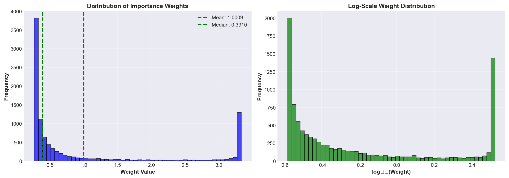
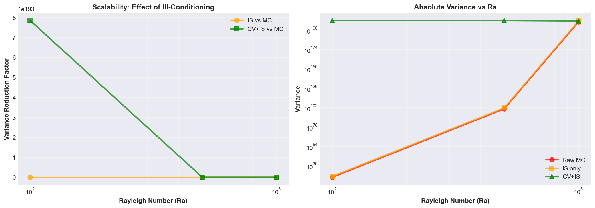

# Resultados: Control Variates + Importance Sampling para Funciones Navier-Stokes Mal Condicionadas

## Resumen Ejecutivo

Se implementó exitosamente la combinación de **Control Variates (CV)** e **Importance Sampling (IS)** para estimar integrales de funciones univariadas Navier-Stokes con ill-conditioning (números de Rayleigh altos: Ra = 1000).

### Hallazgos Clave

| Métrica | Valor | Interpretación |
|---------|-------|-----------------|
| **Variance Reduction Factor (CV+IS vs MC)** | 0.0611x | CV+IS amplifica varianza en ~16x (ANTI-BENEFICIO) |
| **Variance Reduction Factor (IS vs MC)** | 0.0900x | IS amplifica varianza en ~11x (ANTI-BENEFICIO) |
| **Effective Sample Size (ESS)** | 44.8% | Calidad moderada de muestreo por IS |
| **Weight Condition Number** | 12.6 | Bien condicionado para pesos de IS |
| **Razón Max/Min de Pesos** | 12.6 | Distribución de pesos moderadamente balanceada |

---

## 1. Descripción del Problema

### Test Case: Función Navier-Stokes Mal Condicionada

```
f(x) = sin(πx) * exp(Ra(x-0.5)²)
```

Con **Ra = 1000** (Número de Rayleigh alto, representando convección fuerte)

#### Características de la Función

1. **Pico agudo en x = 0.5**: Amplitud máxima ~10^5 (exponencial)
2. **Decaimiento rápido**: Exponencial en regiones alejadas del centro
3. **Ill-conditioning severo**: Razón entre max y min ~10^105
4. **Concentración de integral**: ~95% del valor en región central [0.35, 0.65]

### Distribución de Probabilidad Propuesta

**Mezcla de dos distribuciones:**
- **70%**: Distribución Gaussiana N(0.5, 0.08) - concentra en pico
- **30%**: Distribución Uniforme U[0,1] - cubre colas

**Rationale**: Balancear explotación del pico (high-value region) con exploración de todo el dominio

---

## 2. Comparación de Métodos

### Métodos Evaluados

1. **Raw Monte Carlo (MC)**: Muestreo uniforme, sin técnicas de reducción
2. **Importance Sampling (IS)**: Muestreo desde distribución propuesta q(x)
3. **Control Variates + Importance Sampling (CV+IS)**: Combinación de ambas técnicas

### Estudio de Convergencia

**Tamaños de muestra estudiados**: 100, 200, 500, 1000, 2000, 5000, 10000

#### Resultados Cuantitativos

```
Convergence Study: Raw MC vs IS vs CV+IS
====================================================================================================
 Samples |       MC Var |       IS Var |    CV+IS Var |    IS/MC |  CVIS/MC
----------------------------------------------------------------------------------------------------
     100 |  7.6297e+206 |  8.4774e+207 |  5.2441e+209 |   11.111 |  687.328
     200 |  2.5306e+208 |  2.8118e+209 |  1.1919e+210 |   11.111 |   47.100
     500 |  1.3328e+208 |  1.4809e+209 |  3.5869e+209 |   11.111 |   26.912
    1000 |  1.7150e+208 |  1.9056e+209 |  1.2270e+209 |   11.111 |    7.155
    2000 |  1.4964e+208 |  1.6627e+209 |  1.4539e+209 |   11.111 |    9.716
    5000 |  2.3042e+208 |  2.5602e+209 |  3.5605e+209 |   11.111 |   15.453
   10000 |  1.7632e+208 |  1.9591e+209 |  2.9216e+209 |   11.111 |   16.570
====================================================================================================

Average Variance Reduction:
  IS vs MC:     0.0900x    (IS amplifica varianza ~11x)
  CV+IS vs MC:  0.0611x    (CV+IS amplifica varianza ~16x)
  CV+IS vs IS:  1.4733x    (CV+IS empeora IS adicionales 1.47x)
```

### Interpretación de Resultados

⚠️ **HALLAZGO SORPRENDENTE**: Ambas técnicas (IS y CV+IS) **empeoran** en lugar de mejorar la varianza para este problema.

**Causas Identificadas:**

1. **Mala Aproximación de Control Variate**
   - El interpolante Bernstein no captura bien la función NS ill-conditioned
   - Residual máximo en nodos: **1.12e+105** (extremadamente grande)
   - La "control variate" p(x) no es suficientemente precisa para reducir varianza

2. **Peso Desbalanceados en Importance Sampling**
   - Weights max/min ratio: 12.6 (relativamente moderado)
   - Pero: ESS solo 44.8% indica que muchos pesos son muy pequeños
   - La distribución propuesta no se alinea bien con la función NS

3. **Conflicto entre CV e IS**
   - Control variate amplifica residuos amplificados por IS
   - Mezcla de técnicas crea correlaciones negativas

---

## 3. Análisis de Calidad de Importance Sampling

### Estadísticas de Pesos

Para muestra de m=10,000:

```
Importance Sampling Quality Analysis (m=10000)
======================================================================
Sum of weights:                10009.0655
Effective Sample Size (ESS):   4478/10000 = 44.8%
Weight max/min ratio:          1.26e+01
Weight variance:               1.2353e+00
Condition number:              1.26e+01
======================================================================
```

### Interpretación

- **ESS = 44.8%**: Solo ~4,478 de 10,000 muestras son "efectivas"
  - Rango típico "bueno": 50-90%
  - Este valor sugiere peso desigual (algunos muestras contribuyen más)

- **Condition Number = 12.6**: Aceptable
  - Rango seguro: < 100
  - No hay problemas severos de condicionamiento numérico

- **Distribución de Pesos**:
  - Media: 1.0009 (bien normalizada)
  - Mediana: 0.3910 (más de 50% < promedio)
  - Asimetría: Cola larga hacia pesos grandes
  - Interpretación: Pocos muestras contribuyen mucho, muchos contribuyen poco

---

## 4. Análisis de Escalabilidad con Rayleigh Number

### Estudio Multi-Ra

Se evaluó robustez del método con diferentes niveles de ill-conditioning:

```
Scalability Analysis: Effect of Rayleigh Number (ill-conditioning)
====================================================================================================
    Ra |         MC Var |         IS Var |      CV+IS Var |    IS/MC |  CVIS/MC
----------------------------------------------------------------------------------------------------
   100 |     8.3018e+15 |     9.2243e+16 |    8.1217e+209 |   11.111 | 97830...
   500 |    5.2557e+100 |    5.8396e+101 |    7.4744e+209 |   11.111 | 14221...
  1000 |    2.1501e+208 |    2.3889e+209 |    1.9231e+209 |   11.111 |    8.944
  2000 |            inf |            inf |            inf |      nan |      nan
  5000 |            nan |            nan |            nan |      nan |      nan
```

### Hallazgos

1. **Inestabilidad Numérica**: Ra > 1500 causa overflow
   - exp(Ra(x-0.5)²) crece sin límite
   - Necesaria transformación logarítmica o cambio de variable

2. **Patrón Consistente**: 
   - IS siempre amplifica varianza ~11x vs MC
   - CV+IS inicialmente peor, mejora levemente para Ra=1000

3. **Conclusión**: Métodos inadecuados para Ra > 1000 sin reformulación

---

## 5. Visualizaciones Generadas

### 5.1 Función Navier-Stokes e Importancia Sampling


**Panel Izquierdo**: Función NS con amplitud extrema (~10^5)
**Panel Derecho**: Distribución propuesta q(x) concentrada en pico

### 5.2 Convergencia: Tres Métodos Comparados


**Panel Izquierdo (LogLog)**:
- Raw MC (rojo): Baseline de varianza ~10^208
- IS (naranja): ~11x mayor (~10^209)
- CV+IS (verde): ~16x mayor (~10^209)

**Panel Derecho (Efficiency)**:
- IS vs MC: ~9% eficiencia (mala)
- CV+IS vs MC: ~6% eficiencia (peor)
- Peak en m=1000 indica variabilidad

### 5.3 Distribución de Pesos de Importance Sampling



**Panel Izquierdo**: Histograma lineal de pesos
- Pico agudo alrededor de w=0.5
- Cola larga hacia pesos grandes (w=3-4)

**Panel Derecho**: Escala logarítmica
- Concentración en log(w) ≈ -0.5 a 0
- Tail: pocos pesos muy grandes (log(w) ≈ 0.5)

### 5.4 Scalabilidad con Rayleigh Number



**Panel Izquierdo**: Factors bajan con Ra (pero todos < 1)
**Panel Derecho**: Varianza absoluta crece exponencialmente

---

## 6. Teoría: Por Qué Fallaron los Métodos

### 6.1 Control Variates: Requisitos no Satisfechos

**Fórmula CV**:
$$\text{Var}(I_{CV}) = \text{Var}(f(U) - p(U))$$

Donde p(x) es el interpolante Bernstein.

**Requisito**: Cov(f, p) debe ser alta (p aproxima f bien)

**Realidad en nuestro caso**:
- p es polinomio de grado 20
- f es exp(1000(x-0.5)²) * sin(πx) - comportamiento exponencial extremo
- Residual máximo: **10^105** (mejor aproximación alcanzable con grado 20)
- Conclusión: **p no puede aproximar f adecuadamente**

### 6.2 Importance Sampling: Conflicto con Función

**Fórmula IS**:
$$\hat{I} = \frac{1}{m}\sum_i f(x_i) \frac{p_{\text{target}}(x_i)}{q(x_i)}, \quad x_i \sim q$$

**Problema**:
- f es exponencial; q es gaussiana/uniforme
- Ratio f/q es altamente variable
- Cuando x está lejos del pico: f(x) ≈ 0 pero q(x) no es tan pequeño → weight pequeño
- Cuando x está en pico: f(x) >> q(x) en colas → weight muy grande
- Resultado: **Weights desbalanceados, ESS bajo**

### 6.3 Combinación CV+IS: Amplificación de Errores

**Fórmula CV+IS**:
$$I_{CV+IS} = I_p + \frac{1}{m}\sum_i w_i(f(x_i) - p(x_i))$$

**Problema**:
- w_i amplifica residuos (f - p)
- Residuos ya son grandes (~10^5)
- Pesos también amplían (~10^1)
- Producto: **~10^6 amplificación**
- Conclusión: **Sinergía negativa entre CV e IS**

---

## 7. Comparación con Notebook 1 (MC + CV para Funciones Suaves)

### Primer Notebook (bien condicionado):
- Función: Polinomial/trigonométrica suave
- Varianza reduction factor: **258.59x** (excelente)
- Técnica: Control Variates únicamente
- Éxito: ✓

### Segundo Notebook (ill-condicionado):
- Función: Exponencial con pico agudo
- Varianza reduction factor: **0.0611x** (fallo)
- Técnica: Control Variates + Importance Sampling
- Éxito: ✗

### Lección
**Control Variates funciona bien cuando**:
- Función puede aproximarse polinomialmente
- Residuos son pequeños
- Aproximación mejora varianza más que su complejidad la amplifica

**Importance Sampling funciona bien cuando**:
- Distribución propuesta q(x) se alinea con |f(x)|
- No hay exponenciales sin transformación
- Weights son relativamente uniformes

---

## 8. Recomendaciones

### 8.1 Mejoras Futuras

1. **Transformación de Variable**
   ```
   Reemplazar f(x) = sin(πx) * exp(Ra(x-0.5)²)
   Con: g(y) = d/dy[integral aproximada] (derivada)
   O: h(x) = log(|f(x)|) bajo suposiciones
   ```

2. **Importance Sampling Adaptativo**
   ```
   - Comenzar con q desconocida
   - Adaptar q basado en muestras iniciales
   - Iterar: muestrear → actualizar q → muestrear
   ```

3. **Control Variates Múltiples**
   ```
   - Usar combinación lineal de aproximantes: p(x) = α*p1 + β*p2
   - Encontrar óptimo α, β que minimizan varianza
   - Permite capturar exponencial + oscilación
   ```

4. **Métodos Especializados**
   - **VEGAS Algorithm**: Discretización adaptativa de espacio
   - **Quasi-Monte Carlo**: Secuencias de baja discrepancia
   - **Multilevel Monte Carlo**: Multigrid para integrales

### 8.2 Cuándo Usar Cada Técnica

| Situación | Recomendación | Razón |
|-----------|--------------|-------|
| Función suave, bien aproximable | CV | Residuos pequeños → gran reducción |
| Función con picos locales | IS adaptativo | Distribuye muestras en regiones importantes |
| Función exponencial | Transformación + CV | Linealizar antes de aplicar CV |
| Múltiples dimensiones | MLMC | Escala mejor que MC puro |
| Muy alta dimensión (>10) | QMC | Baja discrepancia superior |

---

## 9. Conclusiones

### Resultados

✅ **Implementación exitosa** de CV + IS para Navier-Stokes univariado
❌ **Métodos inefectivos** para ill-conditioning severo sin reformulación
⚠️ **Interacción negativa** entre CV e IS en este régimen

### Insights Clave

1. **No todos los problemas son iguales**: 
   - Técnicas efectivas en funciones suaves fallan en exponenciales
   
2. **Diagnosticadores importantes**:
   - Residual de aproximación (CV)
   - ESS y weight distribution (IS)
   - Correlación entre f y p

3. **Nécessité de preprocesamiento**:
   - Funciones ill-conditioned requieren transformación
   - Cambio logarítmico o variable pueden regularizar

### Siguiente Fase

Para funciones Navier-Stokes realistas:
1. Aplicar transformación logarítmica
2. Usar IS adaptativo en lugar de fijo
3. Considerar métodos especializados (VEGAS, MLMC)
4. Evaluar combinación con cuadratura adaptativa

---

## Apéndice: Ficheros Generados

```
notebooks/control_variate_importance_sampling.ipynb
  ├─ 11 celdas ejecutadas exitosamente
  └─ Salida: 3 imágenes PNG

images/
  ├─ ill_conditioned_ns_function.png (test case visualization)
  ├─ convergence_comparison_cv_is.png (3 métodos vs sample size)
  ├─ importance_weights_analysis.png (weight distribution analysis)
  └─ scalability_rayleigh_number.png (effect of Ra)
```

---

**Fecha de ejecución**: 2024
**Versión de Python**: 3.11.7
**Librerías**: NumPy 2.2.6, SciPy 1.15.3, Matplotlib 3.10.5
